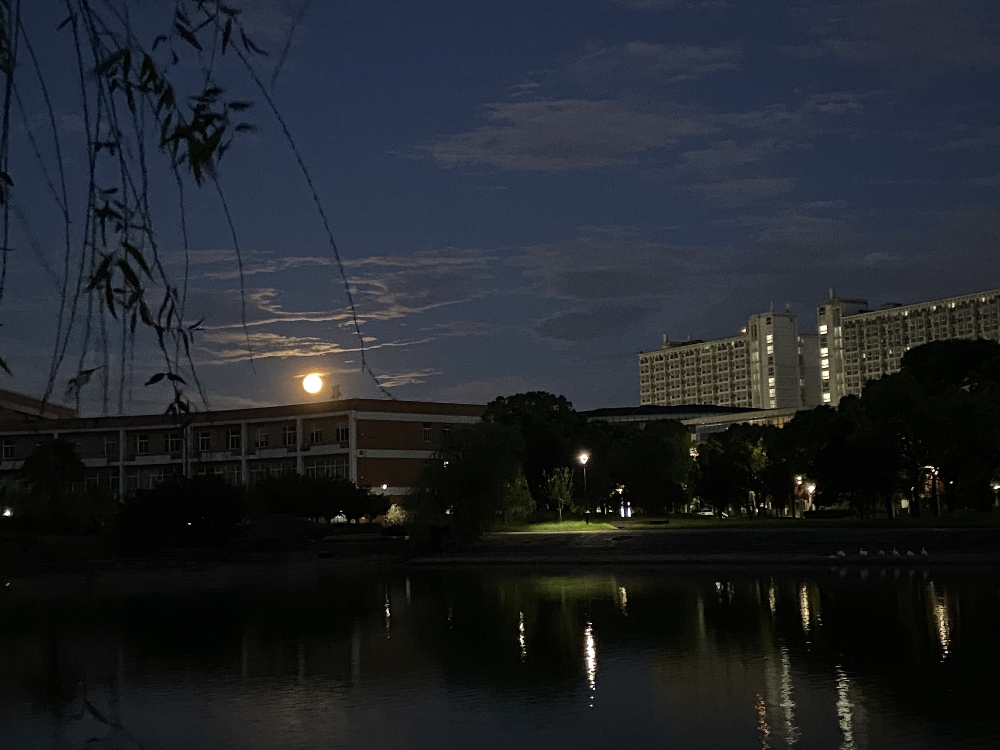
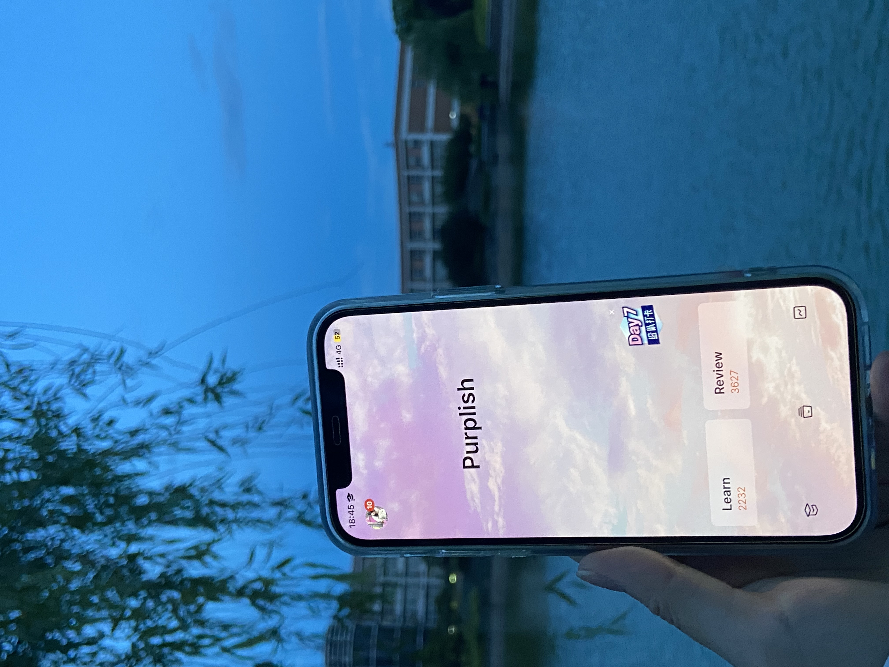

> 离别时，愿诸事顺利。来路总有潮起潮落，这才是人生旅途的意义。——戴尔•埃文斯

## 生活还在继续

结束了一整天的毕业答辩，本科的所有工作也是取得了圆满结束。回寝室的路上，想到往常四年重复得觉得枯燥的生活已经迎来结尾且真正结束的时候，我还是挺伤感的。

回想大学四年，我的记忆好像还停留在决定考研那天。那时候在网上刷到各种名校上岸的网友，于是开始做自己的白日梦，也算是自己的部分动力来源了。

备考大半年，时间如箭，在图书馆见证了校园的季节更替，一道题会钻研做一天，也养成了做笔记的习惯，这半年从来不敢说自己拼尽了全力，但也是认真去对待了。

在宿舍图书馆每天两点一线的日子里，好像没什么特别的事发生，有的只是安静的备考，偶尔周末和女朋友去杭州的景区逛逛。又好像发生了很多，短短半年却填充了我本科时期大部分记忆点。

备考的夜晚无数次在校园散步，手机里也存了无数张随手拍的、相同角度的校园照片，计量的风景可能永远也看不厌吧。

今年2月份，一大早起床等待放榜，出了成绩的时候是有点出乎意料，挺好的成绩，但是没有想象中应该的那样轰轰烈烈的惊喜。于是参加了线下面试，去了未来的学校走走。

好像，就考上了，然后，没然后了。

## 是结束也是开始

考研复试结束以后，隐隐感到自己离开这个校园的日子越来越靠近，到现在才能动手写一点毕业的文字。毕业好像是一次象征性死亡，是原来的大学生身份的死亡。学生当的太久了，对于未来的恐惧，加剧了对毕业的焦虑感。

一年前，我拿着相机，找即将毕业的学姐记录瞬间，转眼间，毕业照的快门下，穿着学士服的那个同学已经变成了自己。

对我而言，大学的意义更像是让我花了四年的时间做到自洽。九月就要成为一个研究生，希望自己能多感受当下，不要焦虑与未来。
